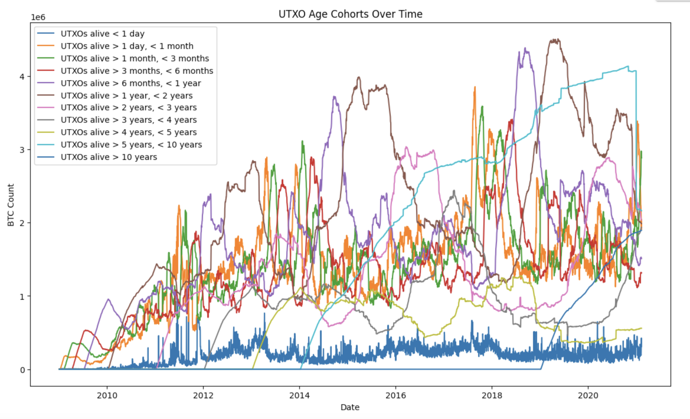

# UTXO Dataset Exploration and Analysis

Welcome to the UTXO dataset analysis project! This repository contains a series of data exploration, statistical analysis, and machine learning sketches on the Bitcoin UTXO (Unspent Transaction Output) dataset. This work is part of an introductory session on data science and machine learning methods for time series analysis and cohort-based modeling.

## Overview
The primary objective of this project is to analyze the Bitcoin UTXO dataset, investigating patterns and behaviors in Bitcoin transaction outputs based on their age cohorts. Using both statistical and machine learning methods, the project demonstrates basic data exploration and forecasting approaches.

### Key Components
- **Data Exploration**: Basic exploration, descriptive statistics, and visualizations of the UTXO dataset.
- **Statistical Analysis**: Visual correlation analysis to understand cohort relationships.
- **Machine Learning**: Simple linear regression models to predict short-lived UTXOs using features derived from other UTXO cohorts.

## Colab Notebook

The main code for this analysis is stored in the Jupyter Notebook file **`ML_Sketches.ipynb`**. This notebook can be executed in Google Colab for an interactive experience, allowing students and researchers to modify parameters and observe immediate outcomes.

### Running the Notebook
1. Open the [ML_Sketches.ipynb](ML_Sketches.ipynb) file directly in Google Colab by selecting "Open in Colab" or uploading it to your Colab environment.
2. Ensure that all required libraries (e.g., `pandas`, `numpy`, `matplotlib`, `seaborn`, and `scikit-learn`) are installed within the Colab environment.
3. Run each cell to replicate the analysis steps, from data loading and cleaning to visualization and modeling.

## Visualization Example

Below is an example visualization from the notebook illustrating the UTXO count distributions by age cohort.

  

## Dataset
The UTXO dataset provides daily snapshots of Bitcoin transaction outputs that remain unspent, categorized into various age cohorts. This dataset allows us to explore Bitcoin transaction behaviors over time, specifically focusing on UTXO age distributions.

| **Variable**       | **Description**                                                        |
|--------------------|------------------------------------------------------------------------|
| Date               | Date of cohort data queried                                           |
| UTXOs alive < 1 day | Unspent BTC created less than one day ago                             |
| UTXOs alive > 1 day, < 1 month | Unspent BTC created between one day and one month ago     |
| UTXOs alive > 1 month, < 3 months | Unspent BTC created between one month and three months ago |
| ...                | and more categories spanning up to 10+ years                           |

For more detailed information, please refer to the dataset documentation on [UTXO Dataset GitHub](https://github.com/SciEcon/UTXO).

